Graphics | [Creative](Creative.md) | [Others](Others.md)

# Ramsey's Portfolio of Fun Development, Games, and Renders 

I'm working my way on splitting this up into three prongs. Bear with me as that happens. For now, this is my rendering page and you can see some random dev stuff over in [other stuff](Others.md). I'll be adding to my [creative pursuits](Creative.md) page at some point. You may be able to catch some of the material on these pages in a different format (sometimes more verbose and sometimes less) on one of [my websites](http://shaunramsey.com).

## Rendering and Fun Images

These are just fun images/animations from different renders throughout the years. The concept of fun or interesting applies to me - so your mileage may vary. Dates are approximations but they should be accurate. I'll do my best to contextualize their creation. Note that this isn't a full development portfolio but I'll link to some of those [here](Others.md). 

### 2025. 

Continued exploration of fragment shaders on shadertoy today. On the way to super fractals, produced the image below, using this [fragment shader](superfractal/lyap.frag). I then moved along to my super fractal and used this [fragment shader](superfractal/super.frag) which is obviously derived from the paper and the other fragment shader I wrote. Anyway, the impressive bit is 12k iterations at 60fps. Gotta love modern GPUs!

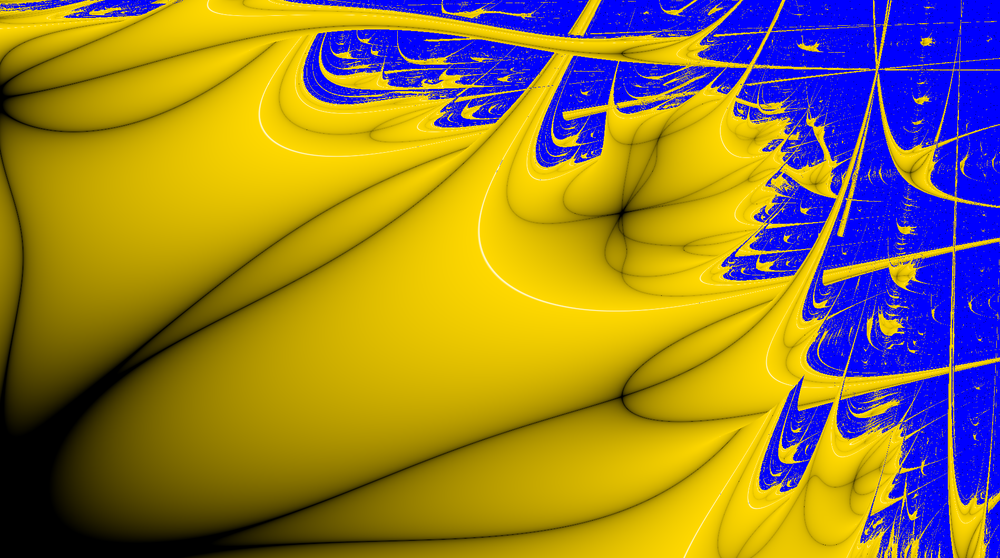 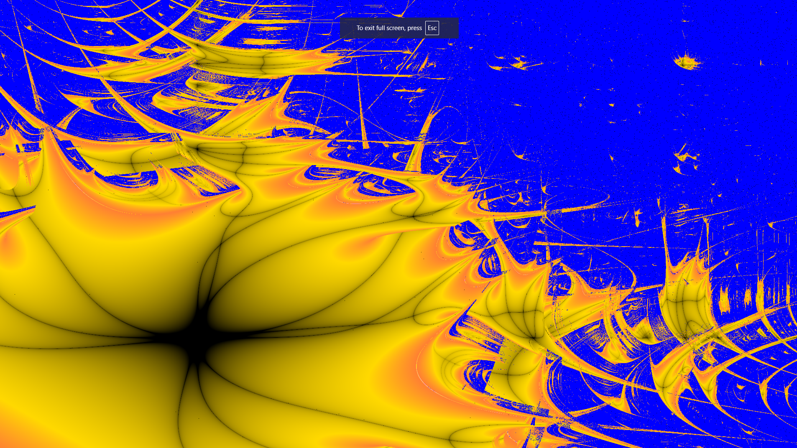

 Played around with raymarching and fragment shaders today. Produced some fun images. I find it really neat that this uses a single signed distance function which is is simply a composite of other signed distance functions. min/max and some smoothing is all you need. I used shadertoy to produce these images via a fragment shader. I did not fine tune the depth (although perhaps it does not need it?). I borrowed from [here](https://www.shadertoy.com/view/XsB3Rm) a bit in my code. You can see the [fragment shader](raymarch/raymarchshader.frag). After a few days I decided to throw in some instancing in this [fragment shader](raymarch/instanceraymarch.frag). These are running at real time rates and really show the power of ray marching.

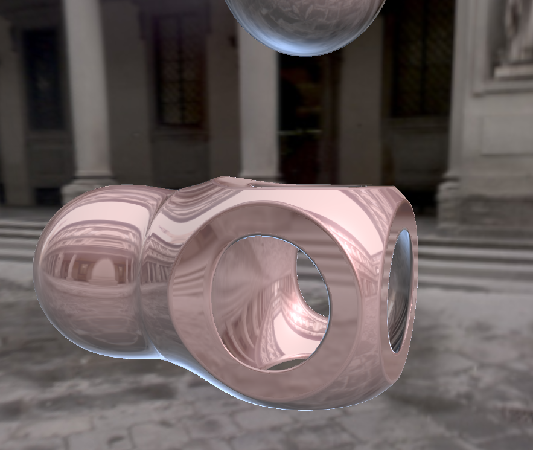 

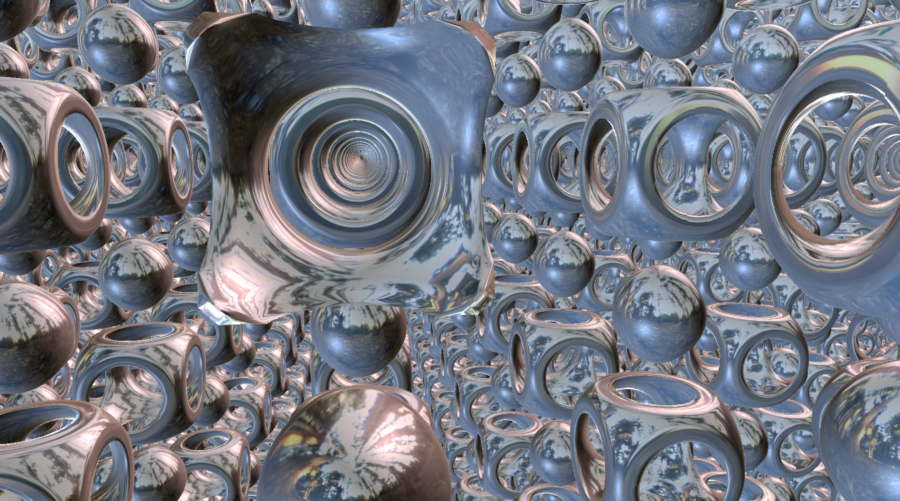 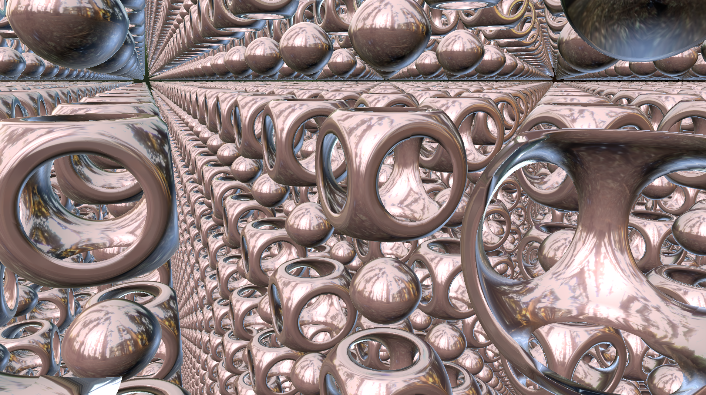

### 2018.

Some of that work with students on the super fractal led to us building a few fun visualizations (mostly to help the students learn iterative functions) like:

  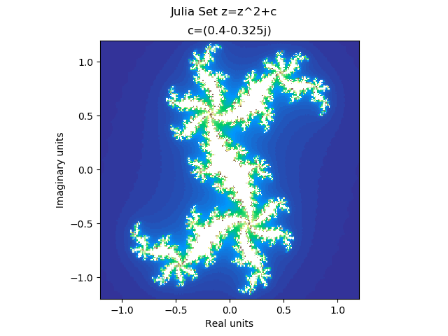 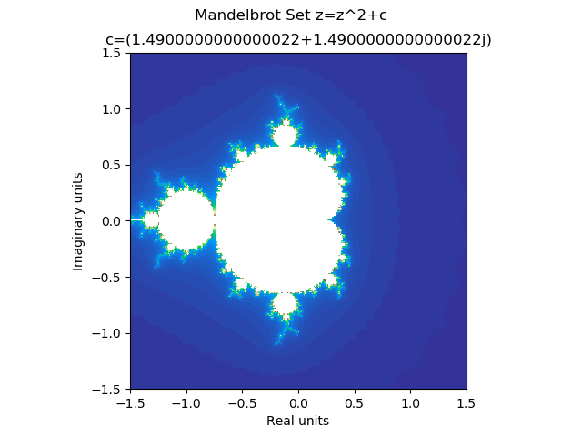 

### 2017.

 The exploration and discovery of the super fractal with Dr. Poulsen was a lot of fun. Building the renderer and parallelizing the computation on cpu was enjoyable. I may explore with making a fragment shader to do the same computation shortly, just as an exersize in working with fragment shaders again. Nevertheless, the images are topologically equivalent to the Lyapunov fractals and were a joy to develop. You can see more about that [here](http://shaunramsey.com/research/superfractal/). I've done more work on that fractal with students since then with a few presentations [here](http://sections.maa.org/epadel/meetings/2018/fall/students.php#1) and [there](http://sections.maa.org/mddcva/MeetingFiles/Fall2021Meeting/Fall2021Schedule.pdf) and even beyond. 

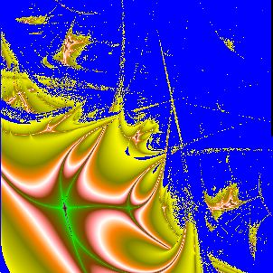 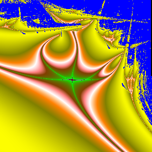 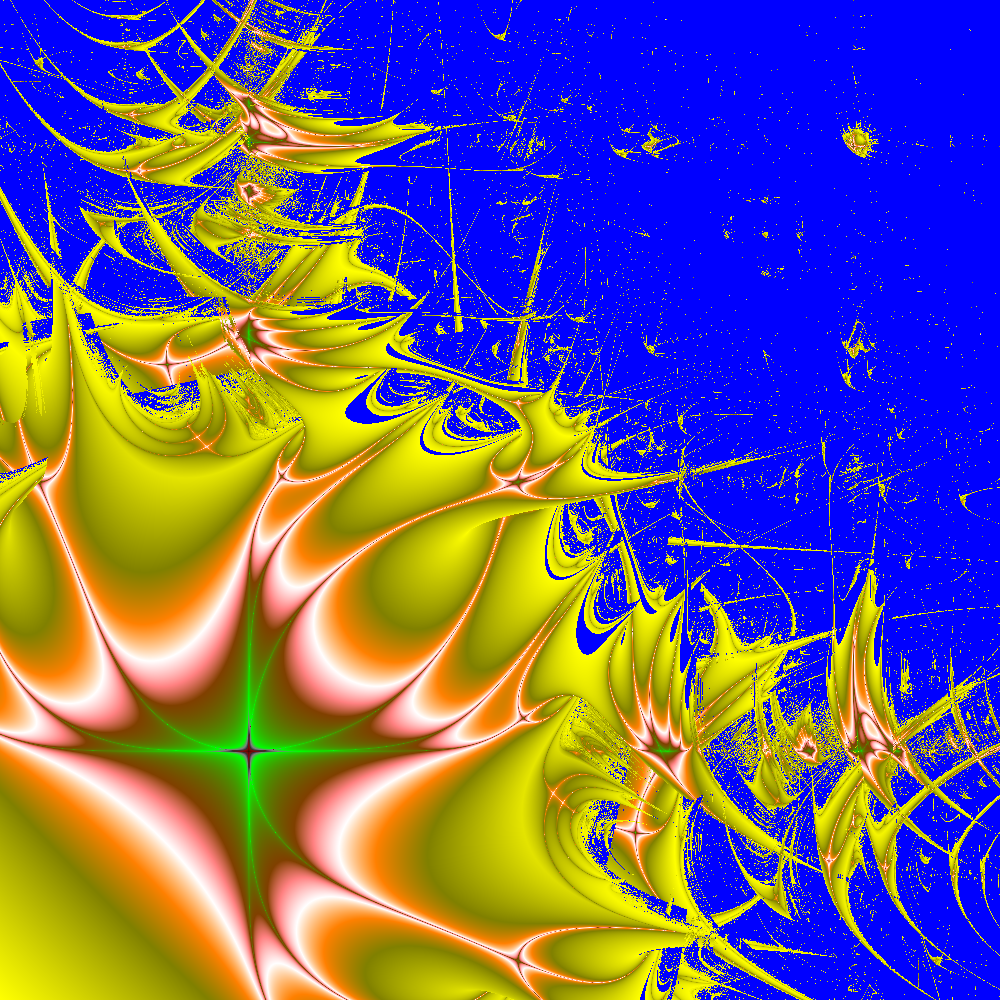

### 2014. 

I was invited to produce a "computed" musical composition based on a photograph of an Icelandic Sea Wall by John Ruppert. This doesn't belong in rendering ... perhaps, but the end result was a rendering and musical composition that I created based on the original image. You can see that [here](http://shaunramsey.com/scholarly/Wall.mp4). I'll throw it here anyway because I think it is interesting.

Give it a listen!

### 2008. 

I worked on Interactive Volumentric Shadow in Participating Media with Chris Wyman in 2008. In this work we used ray marching between shadow volume slices to get those beautiful god rays in participating media. Our results looked so very close to ray traced results. The shader is quite straight forward: [fragment shader](volumetricshadows/shader.frag.glsl). You can see more about that: [here](http://shaunramsey.com/research/vol/)

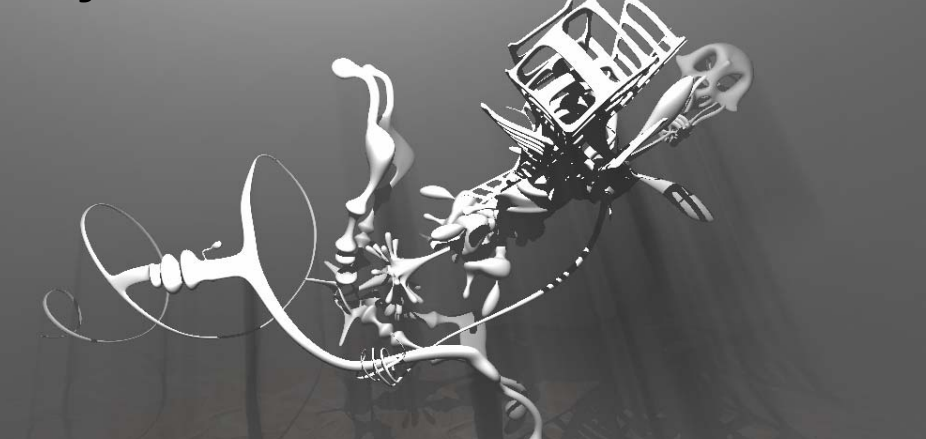

### 2000.

 At this point We'll look at some of my old work from `99 to the early 200s. This is largely fun course work (or going beyond that course work). This work has stuck with me in some way however and thus it is here.

### 2001. 

(or roughly 2001) Ray Tracing with BRDFs using Ashikhmin's anisotropic phong BRDF. For this section and the next, you can see my progress of building up the renderer at [my pages](http://shaunramsey.com/research/imagesynth) along with lots more test values. These images were done as a study in an image synthesis course with Peter Shirley. I also worked on the star-ray ray tracer for 

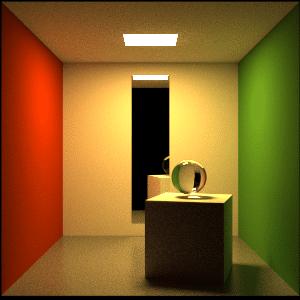 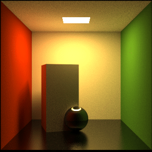

### 2001. 

(or roughly 2001) Photon Mapping with ray traced images using 100 rays per pixel. In order these are: 1x1 Texels w/ 100k photons, 10x10 Texels with 100k photons and 200x200 Texels with 100m photons.

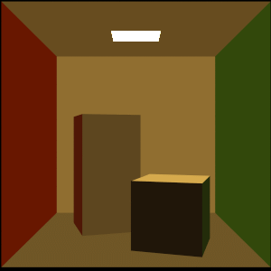 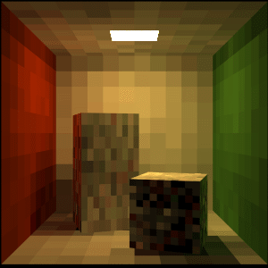 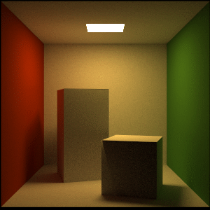

### 2001. 

(or roughly 2001) Terrain Compression Using Wavelets. The left image is the original and the right uses 5% of the coefficients. More at: [my page](http://shaunramsey.com/research/waveletterraincompression/)

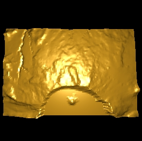 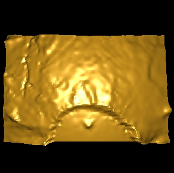

### 2001.

 (or roughly 2001) Some Image Compression. Left is DCT, Middle is HAAR, and Right is Linear B-Spline. The Wasatch is a beautiful backdrop for this, but I'm not sure of the source of the original image at this point. RMSE is about 3 at this level and storage is about 11061 bytes (without other compression techniques) vs raw 65336 bytes. There's some fuzzy math going on there, but you get the gist! More at [my page](http://shaunramsey.com/research/waveletimagecompression/)

 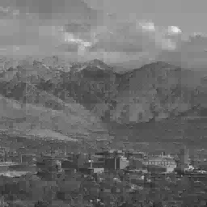 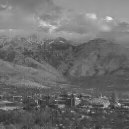

