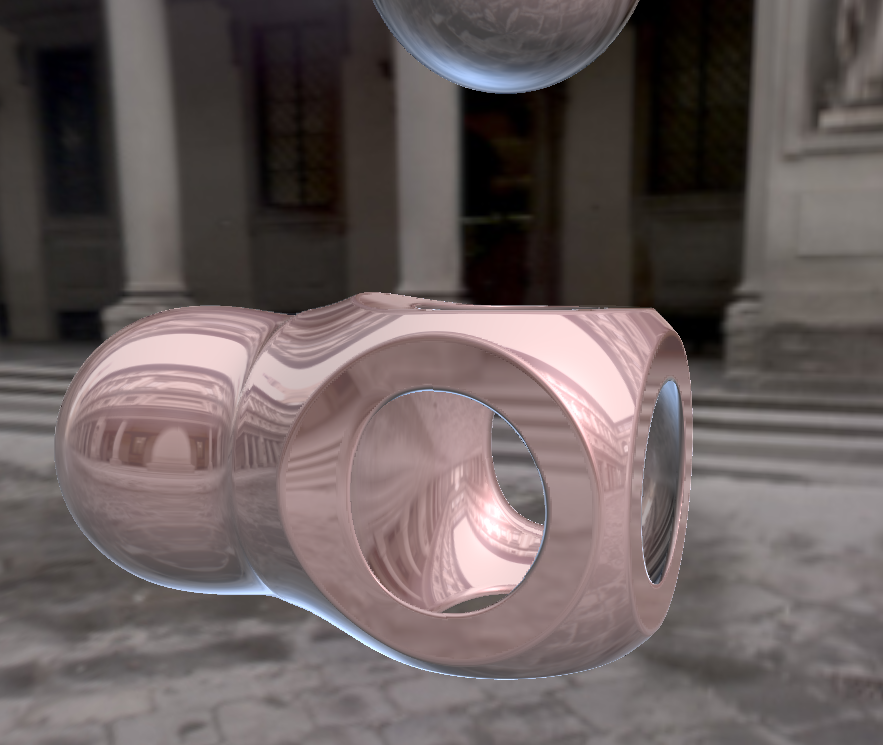
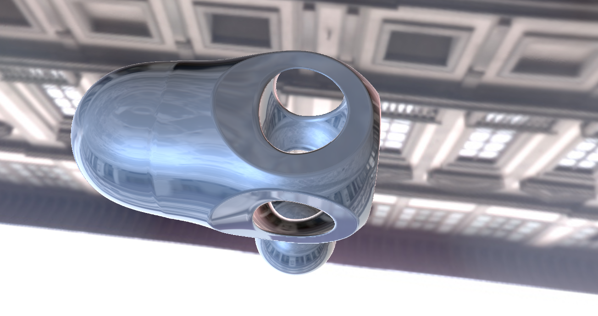

# portfolio
These are just fun images I've made or algorithms I've toyed around with. I'll do my best to contextualize their creation in the readmes.

March 2025
 Played around with raymarching and fragment shaders today. Produced some fun images.

I used shadertoy to produce these images via a fragment shader. I did not fine tune the depth (although perhaps it does not need it?).
Some code was taken from: https://www.shadertoy.com/view/XsB3Rm

Old Work early 2000s

Ray Tracing with BRDFs using Ashikhmin's anisotropic phong BRDF

 

Photon Mapping with ray traced images using 100 rays per pixel.

1 Texel per object with 100,000 photons

10 Texels per object with 100,000 photons

200 Texels per object with 100,000,000 photons

