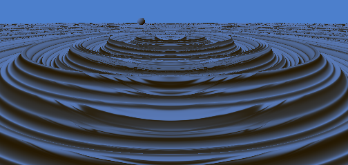
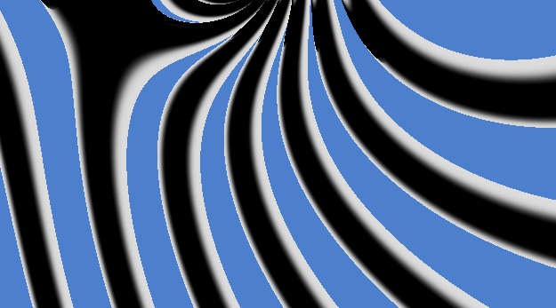
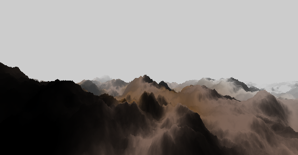

Graphics | [Creative](Creative.md) | [Others](Others.md)

# Ramsey's Portfolio of Fun Development, Games, and Renders 

I'm working my way on splitting this up into three prongs. Bear with me as that happens. For now, this is my rendering page and you can see some random dev stuff over in [other stuff](Others.md). I'll be adding to my [creative pursuits](Creative.md) page at some point. You may be able to catch some of the material on these pages in a different format (sometimes more verbose and sometimes less) on one of [my websites](http://shaunramsey.com).

## Rendering and Fun Images

These are just fun images/animations from different renders throughout the years. The concept of fun or interesting applies to me - so your mileage may vary. Dates are approximations but they should be accurate. I'll do my best to contextualize their creation. Note that this isn't a full development portfolio but rather a place to talk about beautiful math and graphics. I tend to enjoy problems that are challenging and that specifically intersect mathematics and graphics in a very direct way. I also highly enjoy collaboration and despite academia often being a place of silos, I've found a bunch of ways to collaborate with colleagues across the spectrum as you'll likely find in my other pages. In any case, let's get to what I've been working on.

### 2025. 
I spent a good deal of the beginning of 2025 poking at rendering. This meant a healthy dive into Vulkan and shaders. Shadertoy is a great way to experiment with fragment shaders and thus I've been doing a bit of that in between my vulkan dives. You'll see some of those results below.

I spent a day reading through aurora generations. The gist is another sum of sines that's often turned into a distance field in screen space. The ideas lean on Lawlor and Genetti's method which, in turn, used Rong and Tan's jump flooding to produce a blurred distance field from a sum of sines - or even just some other image. Then the 'volume' of the aurora is ray marched to produce an image. So I decided to hack something rather linearly in screenspace just to get a feel for what I would want an aurora to look like. I made this [fragment shader function](raymarch/aurora.frag) and used it as my skyColor (ditching the old gradients and sun calculations). Anyway, this aurora is flat - against the "far plane" rendering rather than a volumetric ray march through an aurora distance field. There are still a few things I'd tweak - even to this flat version - so you may see updates on it in the future.

The last couple days, I've mucked around in shader toy with water generation using sum of sines. I love that you can get direct analytical derivatives from the sines or exponentials of sines. FFT is the natural evolution of this, but sum of sines is a much quicker implementation. Tessendorf's work seems to be where everyone derives their water these days. At this point, through, I hacked in a setting sun with a sky gradient, some whiter wave tips and some solar highlights. Check out the animation. I'm using raymarching - yet again - as it is certainly my favorite thing since sliced bread. 

 

Sometimes, as you're messing around with something new, you get quite a few erroneous steps. Some of these can be fun and interesting. Check out a couple:

 

Terrain generation using fractional Brownian motion is quite interesting. There's a lot of inspiration out there for procedural rendering. I toyed at this one for a bit, but never settled into turning it into true art (a la iq). Still, it was definitely coming along. Everything here is rendered in a fragment shader with noise generated by a texture and the terrain eventually rendered via ray marching.

Added some chroma shift to the spikes from the lens flare. Also fixed the light flaring from the opposite side of the camera. Added some handles for the chroma and some time dependency shifts. Decided to show a toggle of the chroma. This gif begins by showing you a light in the bottom left that does not have lens flare. It's just a little sphere sitting down there. I removed the environment map, but left the geometry to help you really see what the lens flare is adding. Anyway, feel free to try the [fragment shader](lensflare/chroma.frag) for this version. The gif is below, but I'm not sure the 15 fps and color adjustments do the animation full due.

I decided to toy around with adding lens flare to my raymarcher. The gist is built upon the idea that light shining into a lens produces ghost orbs that often show blips of light across the rgb spectrum due to the differing wavelengths / refraction. Often the light itself will appear with spokes. This work builds on and modularizes the work of [Musk's Lens Flare](https://www.shadertoy.com/view/4sX3Rs) but with lots of handles to dial in exactly what you want. I think the effects are probably a lot more "in your face" than where I would want to finally end up - but it really does depend on the brightness of the existing scene or the effect that you're trying to generate. My [fragment shader](lensflare/lensflare.frag) that incorporates the lens flare into the raymarcher below has quite a lot of explanation for generating the ghost orbs and dialing in the 'light flare' effects. But why don't you see for yourself:

  

On the way to super fractals, produced the Lyapunov fractal, using a [fragment shader](superfractal/lyap.frag) on shadertoy. I then moved along to my super fractal and used this [fragment shader](superfractal/super.frag) which is obviously derived from my paper. Anyway, the impressive bit is 12k iterations at 60fps. Gotta love modern GPUs! I eventually pushed on this to [add animation](superfractal/super-lessglobal.frag) and created a small gif for display below. The intersection flipping in the upper right at the end is really when things start to get interesting. The "stability" fighting for different 'a' values in our algorithm is just so very interesting. The gif is only 15 fps, but the renderer runs vsync'd at 60fps on my machine. Load up the fragment shader and let it run for a bit - keeping an eye on that upper corner. For this animation I changed "n" to 2. Just before mainImage you'll see an int nin. That variable represents how many times the value on each axis is repeated before moving to the other. If you know Lyapunov fractals, you're used to seeing "BBAB". Our Super fractal uses something more akin to "AAAABBBB" where one axis is repeated 'n' times and then the other axis is repeated n times. We typically don't talk about them this way in our paper though, referring instead to b_1 and b_2, so in the code you'll see reference simply to "getb" to figure out which "A" or "B" value to grab. Honestly, that's more rambling on this topic than I intended and we're here for the images and animations. So, check it out and ask questions if you have any.

 

 Played around with raymarching and fragment shaders today. Produced some fun images. I find it really neat that this uses a single signed distance function which is simply a composite of other signed distance functions. min/max and some smoothing is all you need. I used shadertoy to produce these images via a fragment shader. I did not fine tune the depth (although perhaps it does not need it?). I borrowed from [here](https://www.shadertoy.com/view/XsB3Rm) a bit in my code. You can see the [fragment shader](raymarch/raymarchshader.frag). After a few days I decided to throw in some instancing in this [fragment shader](raymarch/instanceraymarch.frag). I think removing the cubemap and doing some shadow marching would be interesting. If you view the ray as if it has "volume" you could even do a bit of clipping with nearby geometry for penumbra regions. If we added ids to different geometric pieces, along with a 2D vector to the surface, you could even get very specific with the clipping. Perhaps all those details remove the beauty of the simplicity of the SDF, but it would be a lot of fun to investigate. So, it is something for future investigation.

 

 

### 2018.

Some of that work with students on the super fractal led to us building a few fun visualizations (mostly to help the students learn iterative functions) like:

    

### 2017.

 The exploration and discovery of the super fractal with Dr. Poulsen was a lot of fun. Building the renderer and parallelizing the computation on cpu was enjoyable. I may explore with making a fragment shader to do the same computation shortly, just as an exercise in working with fragment shaders again. Nevertheless, the images are topologically equivalent to the Lyapunov fractals and were a joy to develop. You can see more about that [here](http://shaunramsey.com/research/superfractal/). I've done more work on that fractal with students since then with a few presentations [here](http://sections.maa.org/epadel/meetings/2018/fall/students.php#1) and [there](http://sections.maa.org/mddcva/MeetingFiles/Fall2021Meeting/Fall2021Schedule.pdf) and even beyond. 

  

### 2014. 

I was invited to produce a "computed" musical composition based on a photograph of an Icelandic Sea Wall by John Ruppert. This doesn't belong in rendering ... perhaps, but the end result was a rendering and musical composition that I created based on the original image. You can see that [here](http://shaunramsey.com/scholarly/Wall.mp4). I'll throw it here anyway because I think it is interesting.

Give it a listen!

### 2008. 

I worked on Interactive Volumetric Shadow in Participating Media with Chris Wyman in 2008. In this work we used ray marching between shadow volume slices to get those beautiful god rays in participating media. Our results looked so very close to ray traced results. The shader is quite straight forward: [fragment shader](volumetricshadows/shader.frag.glsl). You can see more about that: [here](http://shaunramsey.com/research/vol/)

### 2000.

 At this point We'll look at some of my old work from `99 to the early 200s. This is largely fun course work (or going beyond that course work). This work has stuck with me in some way however and thus it is here.

### 2001. 

(or roughly 2001) Ray Tracing with BRDFs using Ashikhmin's anisotropic Phong BRDF. For this section and the next, you can see my progress of building up the renderer at [my pages](http://shaunramsey.com/research/imagesynth) along with lots more test values. These images were done as a study in an image synthesis course with Peter Shirley. I also worked on the star-ray ray tracer for 

 

### 2001. 

(or roughly 2001) Photon Mapping with ray traced images using 100 rays per pixel. In order these are: 1x1 Texels w/ 100k photons, 10x10 Texels with 100k photons and 200x200 Texels with 100m photons.

  

### 2001. 

(or roughly 2001) Terrain Compression Using Wavelets. The left image is the original and the right uses 5% of the coefficients. More at: [my page](http://shaunramsey.com/research/waveletterraincompression/)

 

### 2001.

 (or roughly 2001) Some Image Compression. Left is DCT, Middle is HAAR, and Right is Linear B-Spline. The Wasatch is a beautiful backdrop for this, but I'm not sure of the source of the original image at this point. RMSE is about 3 at this level and storage is about 11061 bytes (without other compression techniques) vs raw 65336 bytes. There's some fuzzy math going on there, but you get the gist! More at [my page](http://shaunramsey.com/research/waveletimagecompression/)

  

